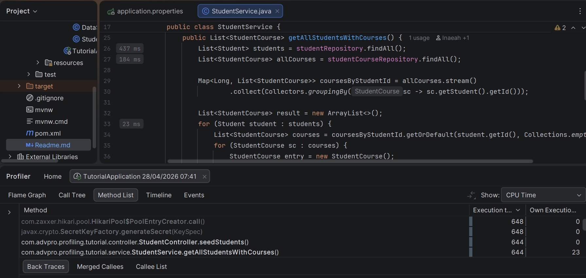
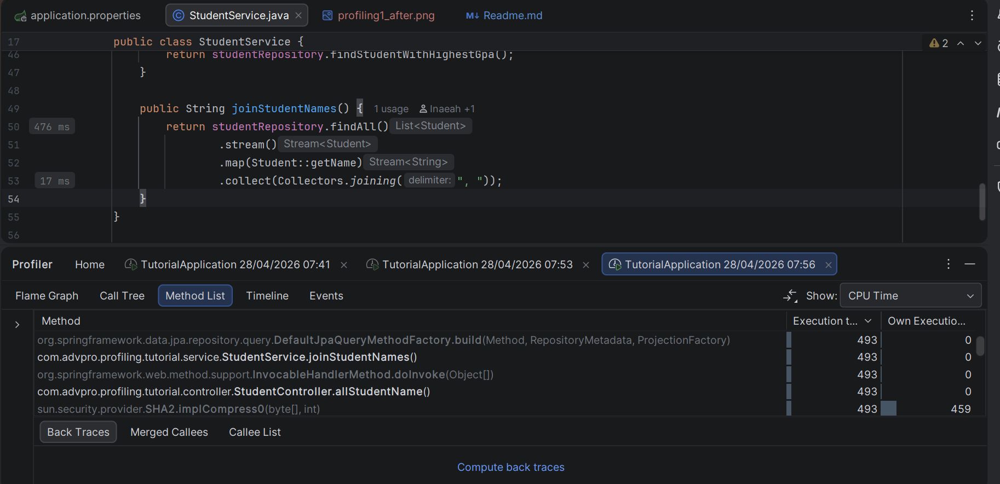
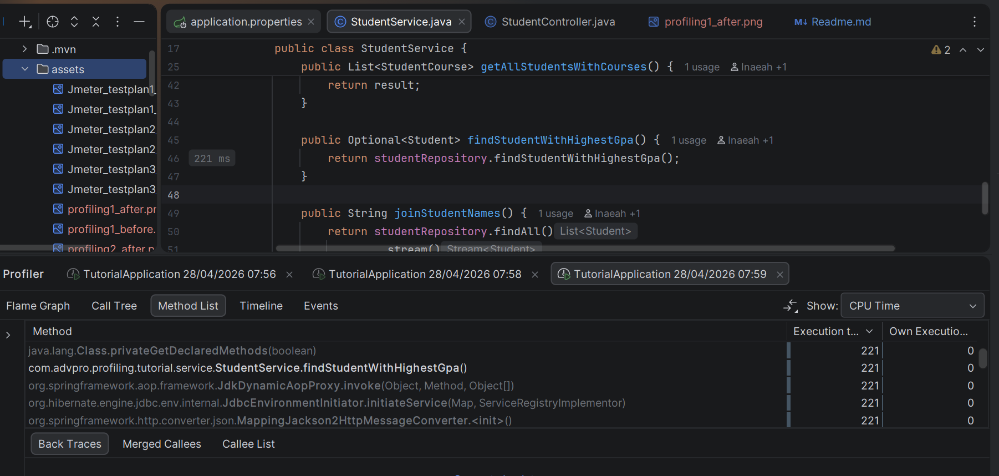

# Tutorial 7 Profiling

<b>Perfomance Testing</b>

### /all-student
#### Before

#### After

Sebelum refactor, rata-rata sample time-nya adalah 41,674 ms, setelah refactor 1,809 ms. Terjadi peningkatan sebesar 95.6%

### /all-student-name
#### Before

#### After

Sebelum refactor, rata-rata sample time-nya adalah 441.6 ms, setelah refactor 234.6 ms. Terjadi peningkatan sebesar 46.8%

### /highest-gpa
#### Before

#### After

Sebelum refactor, rata-rata sample time-nya adalah 84.7 ms, setelah refactor 16.4 ms. Terjadi peningkatan sebesar 80.6%

<b>Profiling</b>

### /all-student
#### Before

#### After

Sebelum refactor, execution time-nya 7,660 ms, setelah refactor 644 ms. Terjadi peningkatan performance sebesar 91.5%

### /all-student-name
#### Before

#### After

Sebelum refactor, execution time-nya 691 ms, setelah refactor 493 ms. Terjadi peningkatan performance sebesar 28.6%

### /highest-gpa
#### Before

#### After

Sebelum refactor, execution time-nya 510 ms, setelah refactor 221 ms. Terjadi peningkatan performance sebesar 56.6%

## Conclusion
Setelah dilakukan optimasi, terjadi peningkatan performa yang signifikan karena perubahan dari pola akses data yang sebelumnya tidak efisien menjadi lebih optimal. Pada implementasi awal, metode `getAllStudentsWithCourses` mengalami N+1 query, yaitu satu query untuk mengambil semua student dan kemudian satu query tambahan untuk setiap student untuk mengambil course-nya, sehingga jumlah query ke database menjadi sangat banyak dan menyebabkan latency tinggi. Setelah diperbaiki, data diambil dalam bentuk semua student dan semua course sekaligus lalu diproses di memory menggunakan struktur map, sehingga jumlah query berkurang drastis dan beban I/O ke database menurun. Hasil dari JMeter menunjukkan penurunan sample time karena sistem tidak lagi menunggu banyak round-trip ke database, sementara analisis dengan profiler memperlihatkan bahwa bottleneck yang sebelumnya berada pada pemanggilan repository berulang kini berkurang dan berpindah ke pemrosesan di memory yang jauh lebih cepat. Selain itu, optimasi tambahan seperti memindahkan perhitungan nilai GPA tertinggi ke query database dan penggunaan `Collectors.joining` untuk penggabungan string juga membantu mengurangi kompleksitas dan overhead di sisi aplikasi. Secara keseluruhan, peningkatan performa ini terutama disebabkan oleh pengurangan operasi I/O yang mahal dan penggantian dengan komputasi di memory yang lebih efisien.

## Reflection
### 1. What is the difference between the approach of performance testing with JMeter and profiling with IntelliJ Profiler in the context of optimizing application performance?

Perbedaannya adalah sudut pandang analisis performa. Jmeter melakukan performance dari sisi eksternal dengan mensimulasikan banyak pengguna, sehingga menggambarkan pengalaman pengguna secara langsung. Sementara itu, Intellij profiler melakukan analisis internal dengan melihat penggunaan CPU, memori, dan eksekusi method. Sehingga bisa mengetahui bagian mana yang menjadi bottleneck.

### 2. How does the profiling process help you in identifying and understanding the weak points in your application?

Karena profiling menganalisis secara internal, profiling dapat memahami bagian code yang lemah dengan memberikan detail terhadap eksekusi program, seperti method mana yang paling lambat, adanya bottleneck, penggunaan memori berlebih, dll. Dengan informasi ini, dev dapat tahu secara spesifik bagian mana yang menyebabkan performa jelek.

### 3. Do you think IntelliJ Profiler is effective in assisting you to analyze and identify bottlenecks in your application code?

Ya. Intellij profiler efektif dalam membantu menganalisa dan mengetahui bottleneck karena mampu memberikan data yang mendalam terhadap perilaku aplikasi saat runtime. Dengan ini, dev dapat dengan cepat menemukan code yang tidak efisien sehingga proses optimisasi lebih cepat dan terarah.

### 4. What are the main challenges you face when conducting performance testing and profiling, and how do you overcome these challenges?

Tantangan utamanya adalah sulit untuk mereplikasi real-world load. Dapat ada perbedaan hasil antara environment testing dan production. kompleksitas dalam menginterpretasikan data hasil profiling juga merupakan salah satu tantangan. Untuk mengatasinya, bisa dilakukan pendekatan seperti menggunakan data dan skenario yang realistis dan menjalankan pengujian secara berulang agar mendapatkan hasil yang konsisten.

### 5. What are the main benefits you gain from using IntelliJ Profiler for profiling your application code?

Manfaat utamanya adalah kemampuan profiler dalam memberikan analisis mendalam terhadap performa aplikasi secara real time, sehingga dev dapat menemukan bottleneck dengan cepat. Profiler membantu meningkatkan efisiensi optimisasi.

### 6. How do you handle situations where the results from profiling with IntelliJ Profiler are not entirely consistent with findings from performance testing using JMeter?

Ketika tidak sepenuhnya konsisten, pendekatan yang bisa dilakukan adalah memahami kedua perspektif tools yang berbeda, internal dan eksternal. Lalu melakukan analisis dengan memeriksa kemungkinan faktor lain seperti network latency, database performance, atau konfigurasi environment.

### 7. What strategies do you implement in optimizing application code after analyzing results from performance testing and profiling? How do you ensure the changes you make do not affect the application's functionality?

Strategi yang saya implementasi adalah mengurangi jumlah query ke database, perbaikan algoritma, dan menggunakan struktur data yang lebih efisien. Untuk memastikan perubahan tidak mememgaruhi fungsionalitas aplikasi, dilakukan unit testing agar aplikasi tetap berjalan dengan benar.

